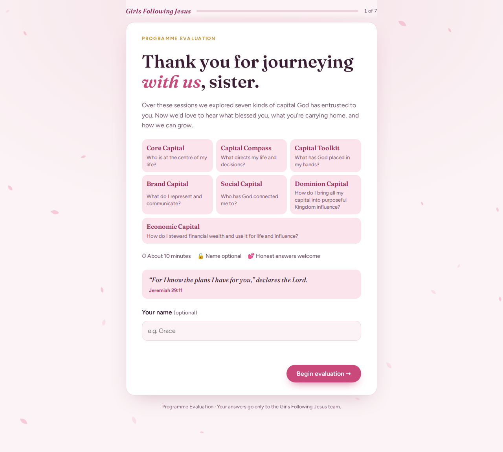

# Girls Following Jesus · Programme Evaluation

An animated, step-by-step evaluation for the Girls Following Jesus programme. Participants rate the seven capitals, share what they're taking away, and give Continue / Stop / Start feedback. Each submission is saved as a row in the team's Google Sheet.

**Live page:** https://conslatekoyo.github.io/Girls-Following-Jesus/

## What's here

| Path | What it is |
|---|---|
| `index.html` | The website (built from `src/index.html`). GitHub Pages serves it. |
| `src/index.html` | The page source. Edit this, then run `./build.sh`. |
| `apps-script/Code.gs` | Google Apps Script that saves responses to the sheet's **Responses** tab. |
| `apps-script/Index.html` | Same page, for serving from the Apps Script web app instead of GitHub Pages. |
| `google-form/create-form.gs` | Optional script that builds an equivalent Google Form. |
| `google-form/header.png` | 1600×400 header banner for the Google Form. |
| `preview/` | Screenshots. |

## How submissions reach the sheet

1. The responses Google Sheet holds `apps-script/Code.gs` (Extensions › Apps Script), deployed as a **Web app** with *Execute as: Me* and *Who has access: Anyone*.
2. `SHEET_URL` in `src/index.html` is that deployment's `/exec` link.
3. On **Submit**, the page posts the answers to that link and shows the thank-you popup. The script adds a row, or updates the row if the same response is sent again.

After changing `Code.gs`, redeploy with **Deploy › Manage deployments › Edit › New version** so the link stays the same.

## Publishing on GitHub Pages

Settings › Pages › Build and deployment › Source: **Deploy from a branch** › Branch: `main`, folder `/ (root)` › Save.
